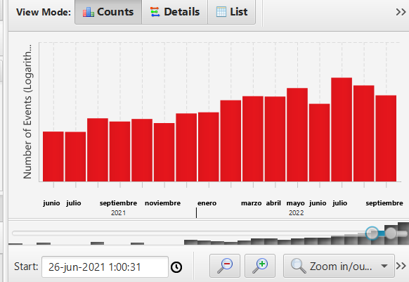

Este post es el proyecto final de grado que entregué en el Grado Superior de ASIR, está centrado en el tema de la ciberseguridad ya que es a lo que me gustaría dedicarme en el futuro.

---

# Análisis forense de sistemas

# Índice

## 1. Introducción:
### 1.1 Presentación del tema y justificación de la importancia del análisis forense de sistemas.
### 1.2 Objetivos del proyecto.
## 2. Marco teórico:
### 2.1 Definición del análisis forense de sistemas.
### 2.2 Técnicas y herramientas utilizadas en el análisis forense de sistemas.
## 3. Autopsy:
### 3.1 Descripción de Autopsy.
### 3.2 Cómo se usa Autopsy.
### 3.3 Análisis de la evidencia recolectada.
### 3.4 Identificación del origen y causa del incidente.
## 4. Trabajo Práctico:
### 4.1 Escenario.
### 4.2 Ejecución.
### 4.3 Conclusión del trabajo.
## 5. Bibliografía:

### 1.	Introducción
__¿Qué es el análisis forense?__

El análisis forense de sistemas es una rama de la ciencia forense que se enfoca en la investigación y análisis de sistemas informáticos, redes y dispositivos electrónicos en busca de evidencia digital que pueda ser usada en investigaciones criminales, litigios o disputas legales. El objetivo del análisis forense de sistemas es recuperar, preservar y analizar la evidencia digital de manera forense para determinar cómo se ha usado un sistema informático, quién lo ha usado y cómo se ha usado.

Puede ser usado para investigar una amplia variedad de delitos informáticos, incluyendo el hacking, la falsificación de documentos digitales, el fraude informático, la violación de derechos de autor, el acoso cibernético y otros delitos cibernéticos. 

La evidencia digital recuperada puede incluir archivos, correos electrónicos, registros de actividad, contraseñas, huellas digitales, y otra información relevante que pueda ser usada en un caso legal.

__¿Por qué es importante estudiar análisis forense de sistemas?__

El estudio del análisis forense de sistemas es importante porque permite a las autoridades y a los investigadores recopilar y analizar evidencia digital para identificar a los delincuentes y llevarlos ante la justicia en casos de delitos informáticos.

Además, el análisis forense de sistemas también es útil en la solución de disputas legales, ya que puede proporcionar pruebas para resolver casos relacionados con la propiedad intelectual, el acoso cibernético y la violación de contratos, entre otros.

__Datos de relevancia del tema (aumento de la tasa de delitos cibernéticos)__

Algunos datos relevantes sobre el análisis forense de sistemas son:

Cada vez más delitos implican evidencia digital: con el aumento de la dependencia de la tecnología y la digitalización, cada vez más delitos implican evidencia digital. Según una encuesta realizada por la Asociación Internacional de Investigadores de Delitos Informáticos en 2023, el 74% de los investigadores de delitos informáticos informaron que las investigaciones que llevan a cabo implican la recuperación de evidencia digital.

El costo de los delitos informáticos es elevado: los delitos informáticos pueden tener un costo económico significativo. Según un informe de McAfee, los delitos informáticos cuestan a nivel global alrededor de 600.000 millones de dólares al año.

La demanda de expertos en análisis forense de sistemas está creciendo: según el Buró de Estadísticas Laborales de los Estados Unidos, se espera que el empleo de especialistas en seguridad informática, que incluye expertos en análisis forense de sistemas, crezca un 31% entre 2019 y 2029, mucho más rápido que el promedio de todas las ocupaciones.

### 2. Marco teórico.

__Conceptos claves del análisis forense de sistemas.__

- Evidencia digital: son los datos electrónicos almacenados en dispositivos electrónicos y redes que se utilizan para apoyar investigaciones legales. Ejemplos de evidencia digital incluyen registros de actividad de red, correos electrónicos, archivos de audio y video, entre otros.

- Ciberdelito: es cualquier delito que involucre el uso de tecnología informática y/o de comunicaciones, como la piratería informática, el robo de identidad, el acoso cibernético y el fraude en línea.

- Cadena de custodia: es el proceso de documentar y rastrear la posesión y el manejo de la evidencia digital a medida que se recopila, se analiza y se presenta en un caso legal.

- Huella digital: es una identificación única de una pieza de hardware o software basada en sus características únicas, como números de serie, fechas de fabricación y números de modelo.

- Forense de red: es la práctica de investigar y recopilar pruebas de delitos cibernéticos que se han cometido a través de redes informáticas.

- Recuperación de archivos: es el proceso de recuperar archivos perdidos o eliminados de un sistema informático.

- Análisis de enlace: es la técnica para analizar conexiones entre diferentes sistemas informáticos, dispositivos y cuentas en línea para identificar patrones de comportamiento sospechosos.

- Trazabilidad: se refiere a la capacidad de rastrear y documentar la historia de la evidencia digital a medida que se mueve a través del proceso de análisis forense de sistemas.

- Metadatos: son los datos que describen la información en un archivo o en un conjunto de datos, como la fecha de creación, la última fecha de modificación y el autor.

- Análisis de correo electrónico: es la práctica de examinar los correos electrónicos en busca de evidencia de delitos cibernéticos.

- Análisis de registros de llamadas: es la técnica para analizar los registros de llamadas telefónicas y mensajes de texto y así identificar patrones de comportamiento sospechosos.

__Herramientas y técnicas que se utilizan.__

- Imágenes de disco: una imagen de disco es una copia exacta de un disco duro u otro dispositivo de almacenamiento. Las imágenes de disco se utilizan para preservar y analizar la evidencia digital sin alterarla.

- Herramientas de recuperación de datos: las herramientas de recuperación de datos se utilizan para recuperar datos eliminados o dañados en dispositivos electrónicos.

- Herramientas de análisis de red: las herramientas de análisis de red se usan para analizar registros de actividad de red y detectar patrones de comportamiento sospechosos.

- Herramientas de análisis de malware: las herramientas de análisis de malware se utilizan para identificar y analizar software malicioso.

- Criptografía: la criptografía se utiliza para proteger la privacidad de los datos mientras se analizan y se almacenan durante el proceso de análisis forense de sistemas.

- Análisis de registro: el análisis de registro implica la revisión de registros de actividad del sistema, como registros de eventos de Windows, para identificar patrones de comportamiento sospechosos.

- Análisis de memoria: el análisis de memoria implica la revisión de la memoria de un sistema para identificar procesos y datos sospechosos.

__La importancia de recolectar y analizar la evidencia digital.__

La recolección y análisis de la evidencia digital es esencial para determinar la causa de un incidente de seguridad en un sistema informático. La evidencia digital puede proporcionar información valiosa sobre las acciones tomadas en el sistema, la identidad de los responsables y la magnitud del daño causado.

En el análisis forense de sistemas, se debe recopilar la mayor cantidad de información posible sobre el incidente, desde el momento en que ocurrió hasta el momento en que se descubrió. Se debe tener cuidado al manejar la evidencia digital para asegurar que se preserve y no se altere. La recolección de evidencia digital puede incluir registros de acceso a sistemas, registros de red, archivos del sistema, correos electrónicos, mensajes de texto, registros de llamadas, ... etc.

La información obtenida del análisis forense puede ayudar a identificar a los posibles delincuentes, proporcionar evidencia para una investigación legal y ayudar a mejorar la seguridad del sistema informático para evitar futuros incidentes.

__Procedimiento de análisis forense de sistemas.__

Fases comunes del proceso:

- Identificación del incidente: en esta fase se identifica la posible existencia de un incidente de seguridad. Puede ser a través de un aviso de la detección de un comportamiento anómalo en el sistema, un reporte de un usuario o incluso una alerta generada por algún software de detección de anomalías.

- Preparación: en esta fase se prepara al personal y los recursos necesarios para llevar a cabo el análisis forense. Esto incluye definir un plan de acción, establecer un equipo de respuesta a incidentes, identificar los recursos y herramientas necesarias para el análisis y asegurar la disponibilidad de los recursos.

- Recopilación de la evidencia: en esta fase se recopila la evidencia digital. Se debe hacer con precaución para evitar alterarla o dañarla. Es importante documentar todo el proceso de recopilación de la evidencia.

- Análisis de la evidencia: en esta fase se examina y analiza la evidencia digital recolectada. Esto puede incluir la identificación de patrones de comportamiento, pistas de navegación y evidencia de actividades maliciosas.

- Documentación: en esta fase se documenta todo el proceso de análisis forense de sistemas. Esto incluye la documentación de la evidencia digital recolectada, el análisis realizado y las conclusiones alcanzadas.

- Presentación de hallazgos: en esta fase se presentan los hallazgos y las conclusiones del análisis forense. Esta información puede ser utilizada para mejorar la seguridad del sistema, identificar a los posibles delincuentes y proporcionar evidencia para una investigación legal.

__Softwares comunes en el análisis forense de sistemas.__

- EnCase Forensic: es una herramienta de pago utilizada para adquirir y analizar datos digitales. Su precio varía según la versión y las opciones seleccionadas, pero suele estar en el rango de los $3000 USD a $8000 USD.

- AccessData Forensic Toolkit (FTK): es otra herramienta de pago que se usa para adquirir, analizar y producir informes sobre la evidencia digital. Su precio varía según la versión y las opciones seleccionadas, pero suele estar en el rango de los $2000 USD a $4000 USD.

- Autopsy: es una herramienta gratuita y de código abierto que se utiliza para adquirir y analizar datos digitales. Ofrece una interfaz gráfica de usuario y se integra con otros programas de análisis forense, como Sleuth Kit.

- Sleuth Kit: es otra herramienta de código abierto que se usa para analizar datos digitales. Proporciona herramientas de análisis de sistemas de archivos y es compatible con sistemas operativos Linux, Windows y macOS.

- Volatility: es una herramienta de código abierto que se utiliza para analizar la memoria volátil de un sistema. Proporciona información sobre procesos, conexiones de red y archivos abiertos.

- OSForensics: es una herramienta de pago que se usa para adquirir y analizar datos digitales. Incluye herramientas para el análisis de la memoria, el sistema de archivos y la recuperación de archivos. Su precio varía según la versión y las opciones seleccionadas, pero suele estar en el rango de los $900 USD a $2000 USD.

__Análisis forense de sistemas en el marco legal. Leyes y regulaciones que regulan el análisis forense de sistemas.__

- Ley de Protección de Datos Personales: esta ley regula el manejo de datos personales y establece las medidas necesarias para garantizar su privacidad y confidencialidad.

- Ley de Propiedad Intelectual: esta ley protege los derechos de autor y la propiedad intelectual, y establece sanciones para aquellos que los infrinjan.

- Ley de Firma Electrónica: esta ley regula el uso de firmas electrónicas y digitales, y establece los requisitos necesarios para que sean válidas y vinculantes.

- Ley de Delitos Informáticos: esta ley establece las sanciones para aquellos que cometan delitos informáticos, como el robo de información, la intrusión en sistemas informáticos y el sabotaje informático, entre otros.

- Reglamento General de Protección de Datos (RGPD): este reglamento establece las normas para el manejo de datos personales en la Unión Europea, incluyendo la recopilación, procesamiento y almacenamiento de datos personales.

__Cómo se debe manejar la evidencia digital para garantizar su validez y legalidad.__

- Documentar todo el proceso: se debe documentar todo el proceso de recolección, preservación y análisis de la evidencia digital, incluyendo la cadena de custodia y cualquier modificación o manipulación que se realice en los datos.

- Utilizar herramientas y técnicas adecuadas: se deben utilizar herramientas y técnicas adecuadas para la recolección y análisis de la evidencia digital, que no alteren o dañen los datos originales.

- Preservar la integridad de los datos: se deben tomar medidas para preservar la integridad de los datos, como hacer una copia bit a bit de la evidencia digital original y trabajar siempre en copias forenses de los datos.

- Proteger la evidencia digital: se deben tomar medidas para proteger la evidencia digital, como almacenarla en un lugar seguro y restringir el acceso a ella solo a las personas autorizadas.

- Garantizar la autenticidad de la evidencia: se debe garantizar la autenticidad de la evidencia digital, asegurándose de que no haya sido alterada o modificada, y que esté vinculada de manera clara y precisa al incidente en cuestión.

- Cumplir con las normativas y regulaciones: se debe cumplir con las normativas y regulaciones aplicables en el manejo de la evidencia digital, y tomar en cuenta las leyes y políticas de privacidad y protección de datos.

### 3. Autopsy.

__3.1 Descripción de Autopsy.__

Autopsy es una aplicación de software de código abierto diseñada para el análisis forense digital.

La aplicación Autopsy proporciona una amplia gama de herramientas y funcionalidades para realizar investigaciones forenses digitales. Permite examinar imágenes de discos duros, particiones y archivos individuales en busca de información relevante y valiosa para una investigación en particular. Esto incluye la recuperación de archivos eliminados, análisis de metadatos, búsqueda de palabras clave, examen de la actividad del usuario y la generación de informes detallados.

__3.2 Cómo se usa Autopsy.__

Creamos un nuevo caso:

En la información opcional se tendría que poner la información que queramos:

Ahora vamos a agregar la fuente de datos:

Seleccionamos la imagen de disco:

En mi caso tengo una imagen de un Ubuntu Server que me he descargado para hacer esta prueba:

Ahora se puede seleccionar todo, pero como solo vamos a hacer un ejemplo, vamos a seleccionar un simple módulo para que pueda ir más rápido.

Ahora mostramos los resultados:

Si nos vamos por ejemplo a las imágenes y pulsamos sobre una, nos saldrán distintas opciones, como la propia imagen(application), la imagen en formato hexadecimal, el texto y File metadata.

La parte de metadata es la más importante, ya que es donde te muestra la fecha exacta de la creación del archivo, el cuando se accedió a ella…

Nos vamos a parar un poco en los Metadatos. Los metadatos son información adicional que describe y proporciona contexto sobre otros datos. En pocas palabras, son datos sobre los datos. Los metadatos pueden incluir una amplia variedad de información, como la fecha y hora en que se creó o modificó un archivo, el tamaño del archivo, el tipo de archivo, la ubicación geográfica en la que se tomó una fotografía, el autor de un documento, los destinatarios de un mensaje de correo electrónico, las etiquetas o palabras clave asociadas a un elemento, entre otros detalles relevantes. 

Esto es lo que se usa principalmente cuando se pide una investigación forense.

Si queremos buscar algo más en especifico, como las cosas más recientes que se han usado, podemos irnos a “Timeline”.

Dentro de timeline podemos buscar los archivos durante una fecha específica, si nos fijamos en la parte de abajo hay una línea, esta la podemos mover buscando la fecha en la que queremos, por ejemplo:

Autopsy nos permite crear informes sobre algunos documentos de nuestro caso, si pulsamos en Generate Report,

Nos saldra de que formato queremos hacer el informe, por ejemplo selecciono la extensión txt.

Ahora si miramos donde tenemos guardado el caso, podremos ver que hay una carpeta llamada generate report con el nombre del reporte que hemos puesto y ahi nos saldra el conetido del mismo:

## 4.Ejemplo Práctico.

__Escenario__

Has sido contratado como analista forense para investigar un presunto delito de un trabajador al cual se le está acusando de compartir archivos a otras empresas o de modificar archivos de la empresa sin permiso.

__Ejecución__

Usamos autopsy para escanear todo el equipo, después nos vamos a una fecha espécifica en la cual se nos ha dicho que se han compartido los datos, así que vamos a incluir una semana más por si acaso.
Después procederemos a examinar los documentos en el timeline, y como podemos comprobar se pueden ver las modificaciones de los documentos:

Ahora pulsamos sobre un archivo y buscamos si ese archivo ha podido ser modificado o enviado:

Los Inode Times son marcas de tiempo asociadas a un archivo en sistemas de archivos Unix y Linux. A continuación te explico el significado de cada uno de los tiempos:

- Accessed (Accedido): indica la última vez que se accedió al archivo, es decir, la fecha y hora en la que se leyó o consultó el contenido del archivo. En el ejemplo proporcionado, el archivo fue accedido el 26 de febrero de 2023 a las 08:10:25.211598143 (CET) (Hora estándar de Europa Central).

- File Modified (Archivo modificado): representa la última vez que se modificó el contenido del archivo. Esto incluye cambios en el contenido, atributos o metadatos asociados al archivo. En el ejemplo el archivo fue modificado por última vez el 5 de febrero de 2022 a las  5:10:38.000000000 (CET).

- Inode Modified (Inode modificado): el Inode es una estructura de datos en el sistema de archivos que contiene información sobre el archivo, como permisos, propietario, tamaño y ubicación física en el disco. La marca de tiempo de "Inode Modified" se actualiza cuando se modifican los metadatos del archivo, como los permisos. En el ejemplo el Inode del archivo fue modificado el 26 de febrero de 2023 a las 08:10:25.211598143 (CET).

- File Created (Archivo creado): indica la fecha y hora en la que se creó originalmente el archivo. En el ejemplo el archivo fue creado el 26 de febrero de 2023 a las 08:10:25.211598143 (CET).

__Conclusión del ejemplo practico__

Hay una anomalía en los datos de los tiempos de los Inode. La marca de tiempo "File Created" (Archivo creado) y los tiempos "Accessed" (Accedido) e "Inode Modified" (Inode modificado) son idénticos, hasta los nueve dígitos decimales. Esto es muy poco común y podría indicar un error o un problema en la generación de los tiempos de los Inode.

