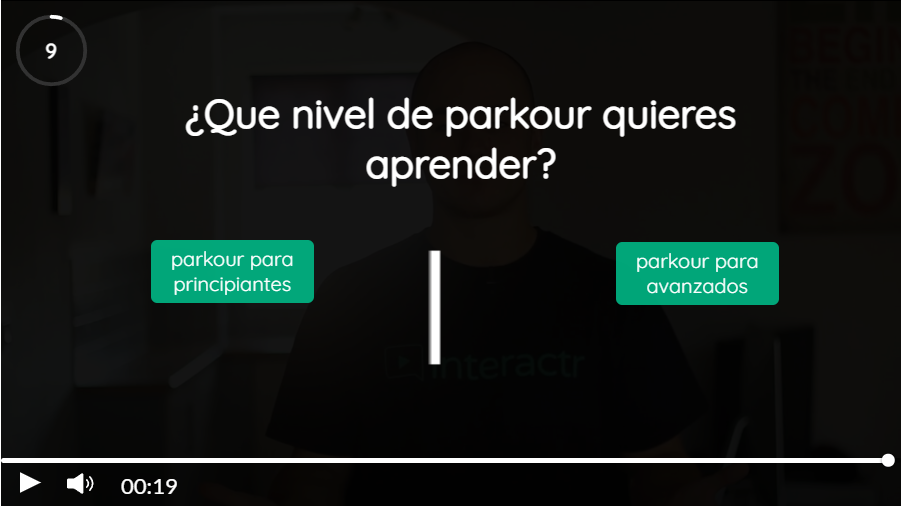
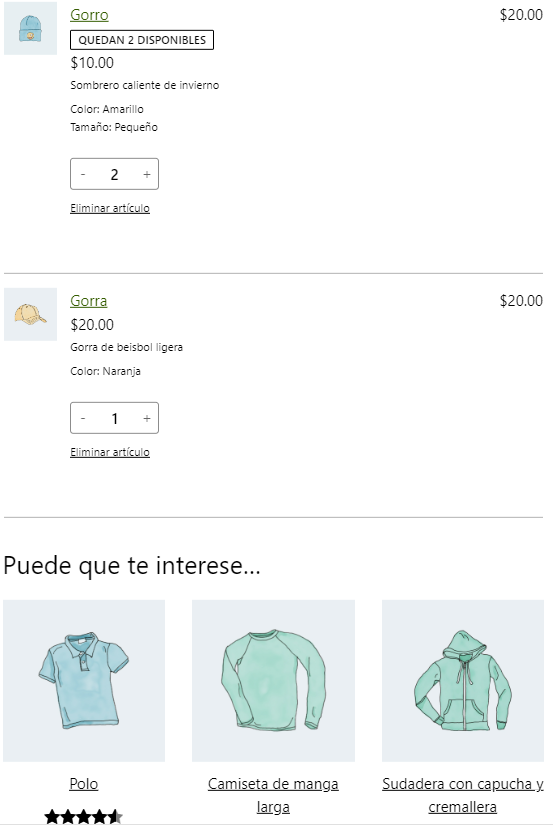
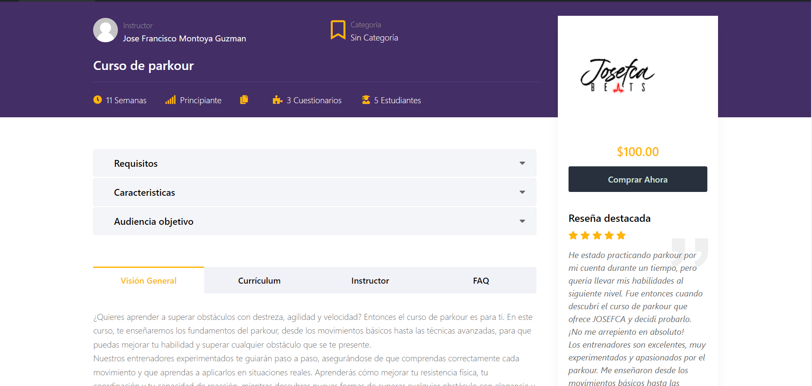

## 29/03/2023

Hoy ha sido el primer dia que he conocido a mi encargado, tambien es el jefe de la empresa.

Al ser el primer dia, nos hemos presentado cada uno. Tambien tengo un compañero de grado medio.

Nos ha explicado Tom (nuestro jefe) como se organiza, los proyectos que tiene en mente, su ambición por aprender y enseñar.

Siendo sinceros me ha caido muy bien y creo que voy a aprender mucho de él.

Nos ha dicho algunas de las cosas que vamos a hacer diariamente como subir videos y noticias a interalmeria y nos ha enseñado un poco como 
se hace.

Hoy como primer día he ido a arreglar un ordenador a una empresa. Nos habian dicho que el ordenador encendia pero no transmitia señal al monitor, asique he pensado que el cable hdmi estaba roto o mal encajado. Despues de varias comprobaciones parecia ir todo correctamente, asique por ultimo he desmontado la tarjeta grádica y la ram y ha empezado a funcionar, pero ahora lo que no arrancaba era el Windows, despues de varios intentos de reparación he decidido llamar a Tom y me ha pedido que le llevara el ordenador para restaurarle el windwos ya que yo no tenia en ese momento nada.

En general he disfrutado mucho de esta experiencia, aunque era un trabajo "sencillo" ha sido la primera vez que he puesto mis conocimientos a prueba.

Por último, he empezado a adelantar cosas que se que voy a necesitar usar los proximos dias, como instalar el editor "Davinci Resolve".
He estado probandolo ya que no quiero tardar mucho el día que lo tenga que usar.

## 30/03/2023

Hoy ha sido un dia de teletrabajo, me he puesto a investigar un poco sobre wordpress ya que llevo mucho tiempo sin tocarlo y poniendome al dia con las actualizaciones que han tenido.

Después he estado buscando temas donde inspirarme para hacer una página de prueba para la asociación ANDA (Asociación de niñoscon discapacidad de Almería). Despues de buscar y buscar ya me hice una idea de lo que tenia.

Aqui dejo una muestra de lo que he estado realizando y en caso de clicar en la imagen te llevara a la pagina por si quieres mirarla más a fondo.

{:target="_blank"}

Por la noche hemos tenido una reunión con Tom donde me ha enseñado a publicar las noticias y tambien he realizado mi primera publicación en Interalmeria.

Por último, he estado buscando algun curso de informatica que pueda hacer durante estos 3 meses, y por ahora voy a hacer uno de wordpress y otro de ciberseguridad.

## 31/03/2023

Hoy al ser viernes le dedico poco tiempo asique he avanzado un poco en la pagina web de ANDA (enlace arriba)

## 10/04/2023

Hoy volvemos de las vacaciones de Semana Santa, durante estas vacaciones he estado pensando mucho en que nuevas cosas voy a querer estudiar.

He pensado en estudiar la reparacion de telefonos móviles, algo que me dijo Tom que nos podria enseñar asique se lo propondre empezar.

Hoy he empezado temprano teletrabajando con el tema de la página web ANDA y mas tarde he ido a las oficinas.

En las oficinas hemos estado viendo un poco los proyectos que vamos a hacer y hemos empezado a enlazar cables. Despues nos hemos ido a la empresa de Candil(una radio de huercal) y hemos estado ayudando en unos cambios que querian hacer y despues Tom nos ha explicado como funciona todo ahi ya que fue el quien lo hizo.

Hoy he dedicado la tarde a aprender sobre el tema de los moviles y por la noche he estado subiendo las publicaciones para interalmeria.

## 11/04/2023

Esta mañana la he dedicado a terminar de publicar los videos de toda la semana para ir quitandome trabajo, aparte he estado mirando cosas de wordpress para ver si podia mejorar la página web.

Por la tarde he estado con el tema de los moviles por mi cuenta, donde me han dado 3 moviles.

El primer movil ha sido un huaweiY300 que realmente no he tocado muhco, investigando un poco por internet he dado con el fallo que suele tener y lo he arreglado.

El segundo movil era un blackberry 8900, que le he cambiado la bateria por otro que tenia en mi casa que si funcionaba y ha funcionado asique el problema residia en la bateria.

El último creo que era un iphone 5, ya que ni se enciende ni nada, este al abrirlo no se mostraba como en los tutoriales de internet, he visto que tenia una placa de metal que no he sabido ni como quitarla, por lo visto esta placa debería estar pegada a la pantalla pero he decidido para con el iphone y ya preguntare a alguien que tenga más conocimientos que yo.

Al acabar el dia he publicado las 4 noticias que tenian que ser para mañana.

Al llevar varios días trabajando con Tom y con el teletrabajo, siento que cada vez hago las cosas mas rápido, tengo más motivación por la informática y lo más importante estoy aprendiendo(aunque algunas cosas sean basicas).

## 12/04/2023

Hoy he estado por la mañana temprano cogiendo ideas de otras páginas y haciendo cambios en la página de ANDA de los cambios que me pedía Tom.

Más tarde he ido a la oficina y hoy hemos estado con los cables detectando que cables eran y a los que les faltaba el cabo del RJ45 B se los he estado poniendo, que me ha venido bien ya que habia hecho dos en toda mi vida.

Por la tarde he vuelto a la oficina y he estado mirando con Tom posibles proyectos de futuro y me ha encargado un servidor antiguo que tiene investigar sobre el.

Por la noche me he dedicado mas que a publicar las noticias del día y un nuevo video.

## 13/04/2023

Por la mañana hemos estado en teletrabajo, el cual he estado un poco investigando sobre el servidor y sobre wordpress.

Por la tarde hemos estado Tom y yo arreglando una impresora(sin éxito) y más tarde me he quedado terminando de poner los cabo a los cables y una vez hecho esto los he ordenado.

Más tarde Tom me ha pedido que busque en casa errores en la página del ayuntamiento de huercal y le envíe un informe sobre estos errores y cambios que proponga.

Para finalizar el día hago las publicaciones de las noticias.

## 14/04/2023

Hoy he tenido un dia tranquilo donde voy a investigar sobre wordpress, voy a hacer unos planos de la oficina para señalar donde estan los cables con sus respectivos números. Tambien me he descargado wordpress y he intentado pasar la pagina de ANDA a ese wordpress pero estoy teniendo problemas.

Más tarde voy a hacer las publicaciones del fin de semana para que se publiquen el lunes. Me queda pendiente buscar información de wordpress y sobre el servidor que quiere Tom instalar.

## 17/04/2023

Por la mañana he estado intentando configurar correctamente lo de wordpress con la página de ANDA, ya que al principio no me dejaba poner el contenido que habia exportado-importado como página de inicio. Cuando he solucionado este problema me he dado cuenta que lo que exporta es una versión antigua de la página xd.

Por la tarde he ido a la oficina y hemos estado hablando de un nuevo proyecto que le han pedido a Tom. Este proyecto era una página de un hombre que hace musica y parkour. Nos pedia que hicieramos algo parecio a otra página, pero Tom quiere que intente ir a más y hemos estado sacando ideas. Más tarde he estado ayudando a mi compañero a subir videos y noticias a interalmeria ya que el no sabia y esta semana le tocaba a el hacerse cargo.

## 18/04/2023

Hoy por la mañana he estado por mi cuenta haciendo la página del parkour y dando las ideas que podriamos hacer, aparte he estado aprendiendo mas de elementary.

Me he puesto a hacer el tfg de mi grado y he decidido que cuando vaya a terminarlo lo publicare en otro post. He pensado en hacerlo de Análisis forense de Sistemas.

Por la tarde he ido a la oficina y hemos estado hablando Tom y yo sobre las distintas opciones que tenemos para poder crear la página de parkour. He aprendido mucho hoy de Tom y me ha enseñado como se utiliza infinity y para que sirve.

Por la noche he estado investigando sobre una aplicacion llamada "interactrapp" en la cual vamos a crear videos interactivos en la web del parkour.

## 19/04/2023

Por la mañana he estado creando los distintos diseños, unas 15 opciones a elegir, despues he creado el video interactivo, donde he creado dos opciones a enviar al cliente, una con imagenes y otra con botones.

Por la tarde hemos estado hablando de la página y tom me ha estado ayudando con mis diseños y dandome ideas, despues le he mejorado el informe y me ha enseñado a crear una propuesta para el cliente junto con el presupuesto. Tambien hemos estado hablando de socialmedia(la app donde publicamos las redes sociales de Interalmeria) y he ayudado a solucionar el problema que habia de publicaciones en Instagram.

## 20/04/2023

Hoy hemos estado hablando de la página de la cual hemos creado diseños de las distintas partes ya que como ibamos a tener el jueves la llamada con el cliente nos teniamos que dar prisa asique simplemente hemos estado con los diseños.

Hemos empezado por la mañana haciendo un diseño de la tarjeta de regalo que queria el cliente, en mi caso he hecho dos, dejare una imagen de una para dejar un ejemplo, más tarde he estado aprendiendo un poco de woocomerce para crear una tienda y para terminar el dia he aprendido a usar learn press que es un plugin que sirve para hacer un curso.

Dejo ejemplos del diseño de cada cosa que hemos hecho. Empezamos por la tarjeta de regalo:

Ahora vamos por la tienda(solo pongo una imagen pero le enseñamos varias más):

Y una pequeña muestra de como sería el curso:

Por la noche hemos tenido una charla Tom y yo en donde le daba el presupuesto sin precios a Tom y donde le mostraba todo lo que había hecho. Por último tuvo Tom la reunión con el cliente donde decidio aceptar nuestras propuestas.

Más tarde Tom me envio los presupuestos con sus precios, eso supongo que me servira por si viene otro cliente ya hago yo los preciós definitivos. Muy contento en general ya que despues de tanto esfuerzo hemos conseguido que el cliente nos contratase.

## 21/04/2023

Hoy hemos estado un poco de descanso ya que despues de 3 días muy intensos con la página queriamos descansar un poco. De todas maneras he preparado ya todos los videos de la semana que tenia que publicar para que no se me acumule el trabajo la semana que viene.

## 24/04/2023

Hoy hemos tenido una reunión con el cliente donde hemos estado hablando de como vamos a hacer la página, de las ideas y de las futuras ideas que vamos a poder hacer más adelante.

Tambien por la noche he estado haciendo las noticias de InterAlmería.

## 25/04/2023

Hoy hemos estado mirando un servidor y más tarde ha venido el cliente de la página web del parkour donde nos ha pasado los contenidos de la página y hemos estado hablando de como va a querer los videos, de las distintas interacciones de videos que quiere, de como va a hacer el curso.

Tambien le he estado mostrando el posible contenido que puede poner en la presentación del video.

Por la noche he hecho las noticias de InterAlmería.

## 26/04/2023

Hoy hemos estado mirando como hacer que funcione los cables de telefonica y hemos estado probando algunos telefonos que tenia Tom por la oficina.

Por la noche he hecho las noticias de InterAlmería.

## 27/04/2023

Hoy no he ido a las practicas ya que me encuentro enfermo, aunque he estado haciendo por la noche investigación de como recuperar la contraseña de Instagram de Interalmeria y por la noche he hecho las noticias de InterAlmería.

## 28/04/2023

Hoy al ser viernes tendria que haber asistido a clase por la mañana pero al seguir malo no he ido y Tom me ha dicho que descansara y solo he hecho por la noche las publicaciones de Interalmeria para que estuvieran listas para el lunes.

## 03/05/2023

Después del puente y ya recuperado al llegar a la oficina hemos estado hablando Tom y yo del tema servidores, alojamiento etc... para la página de josefca. Me ha enseñado a como administrar el servidor desde webmin y vesta.

Vesta era algo que ni conocia y me ha parecido muy interesante y ya que me ha dado permiso para investigar ahi lo hare pero con mucha precaucion, ya que no quiero romper el servidor.

Tambien hemos estado con los cables de telefonía.

## 04/05/2023

Hemos estado haciendo copias de seguridad en el servidor y Tom me ha pasado una copia de seguridad de la pagina de josefca para que vaya probando cosas en mi propio servidor xampp.

Tambien hemos estado hablando de los distintos proyectos que ha tenido y de sus complicaciones y de las soluciones de los mismo. Esto me ha hecho pensar que lo más importante es saber como poder solucionar el problema y lo bien que se paga eso.

## 05/05/2023

Hoy he estado intentando instalar la pagina web en mi servidor xampp pero me esta dando muchos problemas. Lo más probable esque tenga que pedirle ayuda a Tom.

Tambien me he puesto a mirar un poco el servidor y a toquetearlo con cuidado.

## 06/05/2023

Hoy al ser viernes he estado por la mañana en clase con el proyecto de fin de curso.

Por la tarde he estado haciendo los videos de la proxima semana aunque no los he terminado todos. Más tarde me ha pedido Tom que mirara como hacer programaciones en las publicaciones de instagram. No he tenido muy claro el porque en esta cuenta no funciona, pero por lo que he leído, en moviles iphone se puede hacer esas programaciones de publicaciones. Voy a probar otro dia a intentarlo en un MAC a ver si me deja.

Por terminar el dia he estado haciendo publicaciones en instagram sin programación de hora.

## 08/05/2023

Hoy es puente en Huercal de Almería (donde se ubica la oficina), aun así he decidido ponerme a trabajar un poco para adelantar las cosas.
He estado haciendo las publicaciones de instagram de este fin de semana, he estado editando los videos que me faltaban de la semana para Interalmeria.

Por la tarde he estado haciendo un poco de la página y del TFG.

## 09/05/2023

He estado hoy haciendo teletrabajo, he estado investigando los mejores LMS y he creado un informe para Tom, tambien he pasado todo el contenido de la pagina web de josefca a mi ordenador principal para posteriormente pasarloal servidor y mostrarselo a josefca.

Por la tarde le he dedicado tiempo a las noticias de Interalmeria y a su instagram.

## 10/09/2023

Por la mañana he ido a la oficina y ya he sabido pq no me funcionaba la pagina de josefca, el error estaba en que no se habian pasado correctamente todos los archivos. Ya hoy he empezado con los LMS.

Por la tarde he estado haciendo noticias y tambien a su instagram, tambien estuve investigando como poder mejorar el Landing Page de la pagina de josefca.

