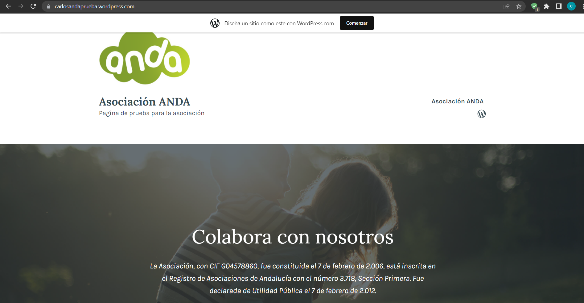

## 29/03/2023

Hoy ha sido el primer dia que he conocido a mi encargado, tambien es el jefe de la empresa.

Al ser el primer dia, nos hemos presentado cada uno. Tambien tengo un compañero de grado medio.

Nos ha explicado Tom (nuestro jefe) como se organiza, los proyectos que tiene en mente, su ambición por aprender y enseñar.

Siendo sinceros me ha caido muy bien y creo que voy a aprender mucho de él.

Nos ha dicho algunas de las cosas que vamos a hacer diariamente como subir videos y noticias a interalmeria y nos ha enseñado un poco como 
se hace.

Hoy como primer día he ido a arreglar un ordenador a una empresa. Nos habian dicho que el ordenador encendia pero no transmitia señal al monitor, asique he pensado que el cable hdmi estaba roto o mal encajado. Despues de varias comprobaciones parecia ir todo correctamente, asique por ultimo he desmontado la tarjeta grádica y la ram y ha empezado a funcionar, pero ahora lo que no arrancaba era el Windows, despues de varios intentos de reparación he decidido llamar a Tom y me ha pedido que le llevara el ordenador para restaurarle el windwos ya que yo no tenia en ese momento nada.

En general he disfrutado mucho de esta experiencia, aunque era un trabajo "sencillo" ha sido la primera vez que he puesto mis conocimientos a prueba.

Por último, he empezado a adelantar cosas que se que voy a necesitar usar los proximos dias, como instalar el editor "Davinci Resolve".
He estado probandolo ya que no quiero tardar mucho el día que lo tenga que usar.

## 30/03/2023

Hoy ha sido un dia de teletrabajo, me he puesto a investigar un poco sobre wordpress ya que llevo mucho tiempo sin tocarlo y poniendome al dia con las actualizaciones que han tenido.

Después he estado buscando temas donde inspirarme para hacer una página de prueba para la asociación ANDA (Asociación de niñoscon discapacidad de Almería). Despues de buscar y buscar ya me hice una idea de lo que tenia.

Aqui dejo una muestra de lo que he estado realizando y en caso de clicar en la imagen te llevara a la pagina por si quieres mirarla más a fondo.

Por último, he estado buscando algun curso de informatica que pueda hacer durante estos 3 meses, y por ahora voy a hacer uno de wordpress y otro de ciberseguridad.

## 31/03/2023