Este post nos mostrara la practica 9. Esta practica fue realizada durante el grado superior de Administracion de Sistemas Informaticos en Red y estamos dentro del modulo de Implantacion de Aplicaciones Web:

---

# Practica 9
Para esta practica vamos a dividirlo en 3 fases, fase 0, fase 1 y fase2.
Vamos a empezar por la fase 00.

# Fase 0

Para la fase 0 vamos a necesitar unicamente una maquina donde vamos a meter todo lo necesario.
Lo primero que vamos a hacer es crearnos un archivo de install_lamp.yml donde vamos a realizar las instalaciones del servidor Apache2 y de MYSQL:

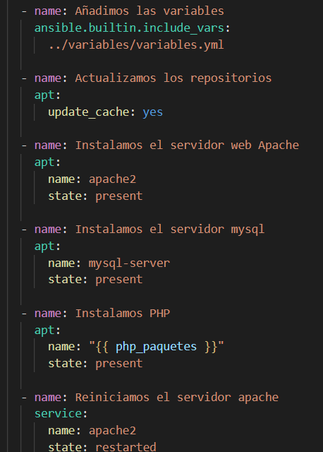

Ahora vamos a crear otro archivo llamado deploy_wordpress.yml donde vamos a empezar por instalarnos unzip y despues wordpress:

Ahora vamos a descomprimir wordpress con unzip y vamos a darle permisos de usuario y grupo a www-data:

Ahora vamos a instalar el gestor de paquetes Python 3, el módulo pypmysql y vamos a crearnos la Base de datos y el usuario de Wordpress:

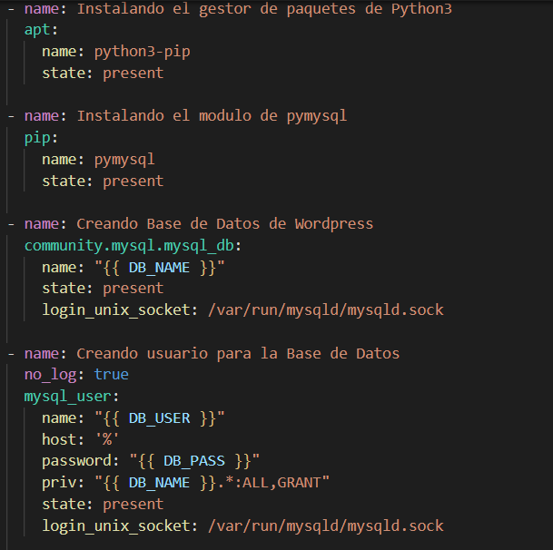

Ahora vamos a configurar las variables de conexión:

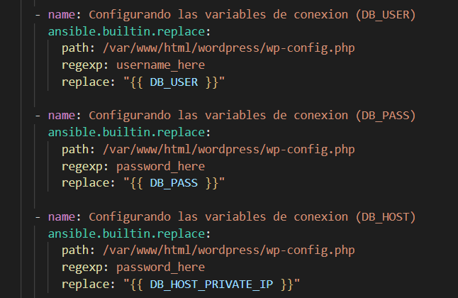

Añadiendo WP_HOME Y WP_SITEURL a wp-config.php:

Configurando las variables de wp-blog-header y vamos a darle permisos de usuario y grupo a www-data:

Ahora vamos a hacer la instalación de certbot. 
Para esto antes debemos instalarnos snap.

Voy a mostrar mi inventario:

Voy a mostrar las variables usadas para esta fase 0:

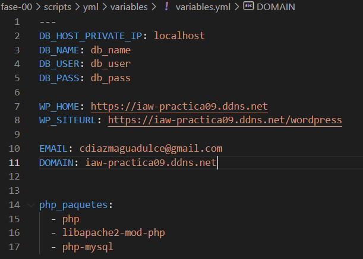

Ahora vamos a comprobar que nos funciona, para eso vamos a irnos a nuestro navegador web y vamos a escribir nuestro dominio:

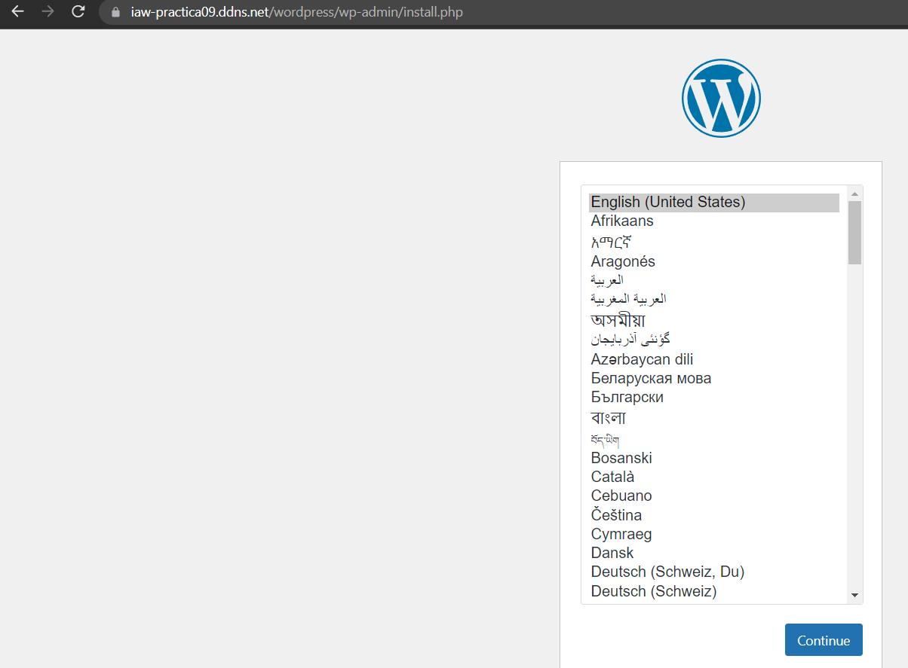

Como vemos nos sale para seleccionar nuestro idioma en la pagina de wordpress.
Una vez seleccionado tenemos que rellenar lo que nos pone con nuestros datos:

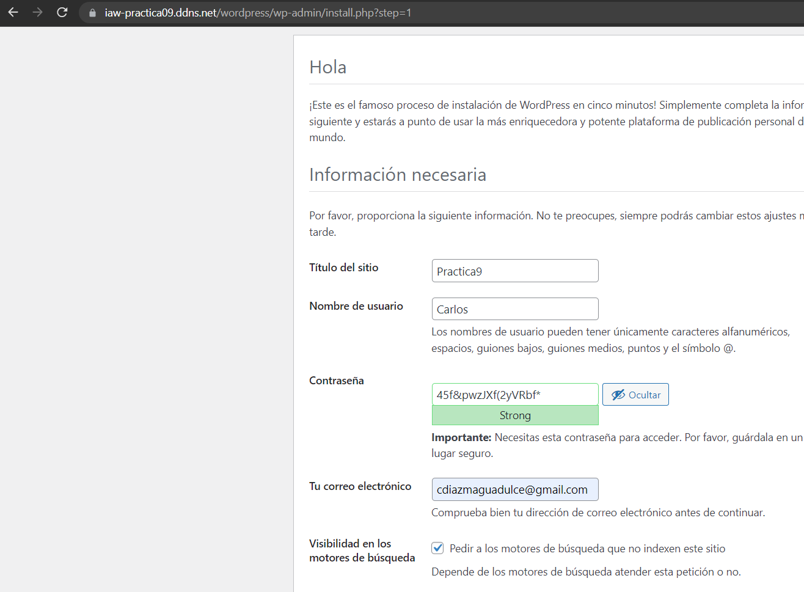

Una vez hecho esto inicias sesión:

Ya deberias de estar en la pagina de wordpress:

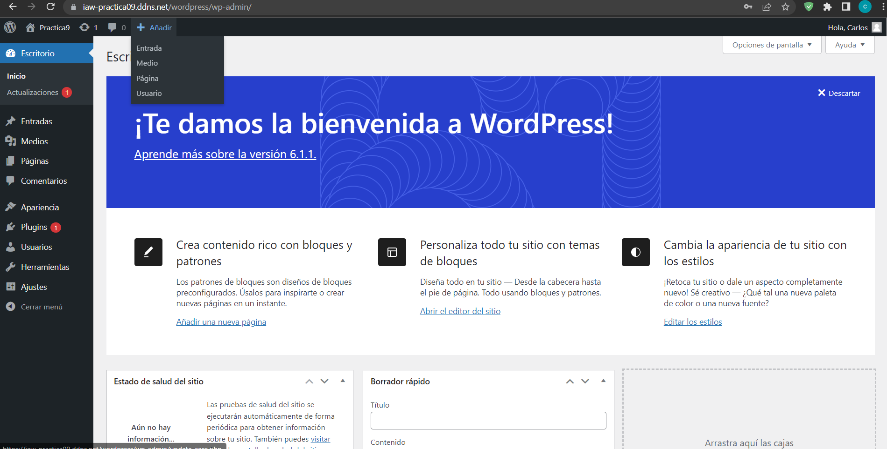

# Fase 1

Ahora vamos a empezar la fase 1. Para esta fase vamos a necesitar dos máquinas funcionando, una que se encargara del servidor web y otra de MYSQL.

Vamos a empezar por explicar el install_deploy que sera donde estara la instalación de MYSQL:

Ahora vamos a irnos al install_frontend donde vamos a instalarnos el servidor Apache:

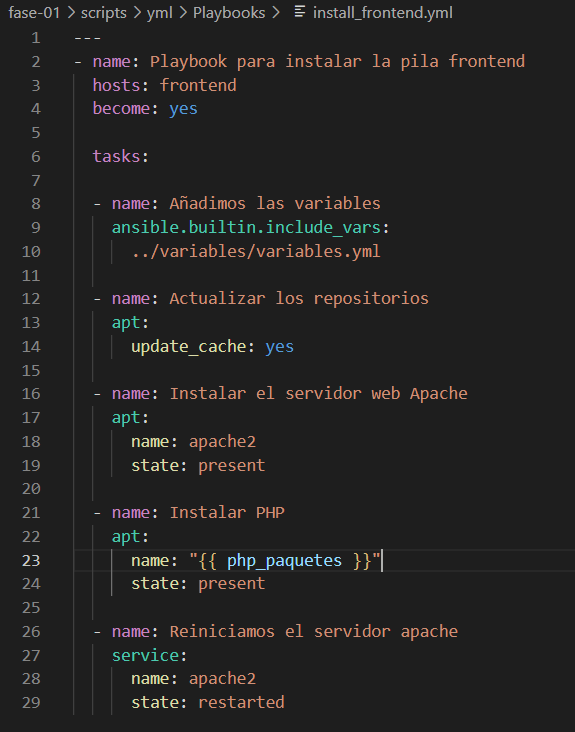

Ahora vamos a explicar el deploy_backend,aqui sera donde vamos a crearnos la base de datos de wordpress y el usuario:

Ahora vamos a irnos al deploy_wordpress, que sera la configuracion de la maquina frontend.
Esto no va a cambiar mucho de la anterior fase. Nos descargamos wordpress y lo descomprimimos:

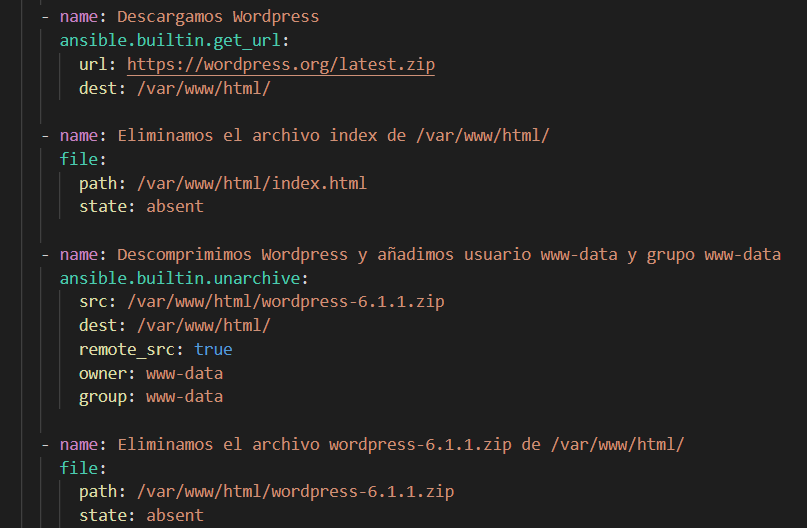

Configuramos las variables de conexion de DB_USER, DB_PASS, DB_HOST y añadimos WP_HOME Y WP_SITEURL a wp-config.php

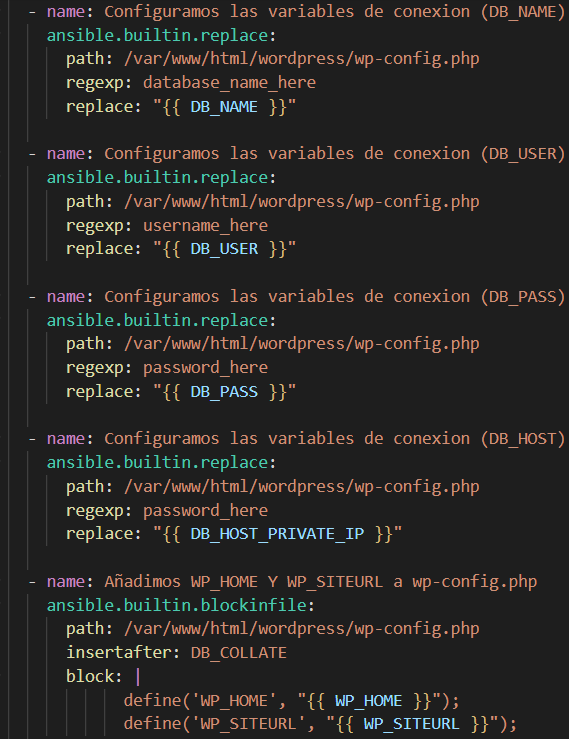

Ahora vamos a Cnfiguramos las variables de wp-blog-header y vamos a añadir permisos de usuario y grupo a www-data

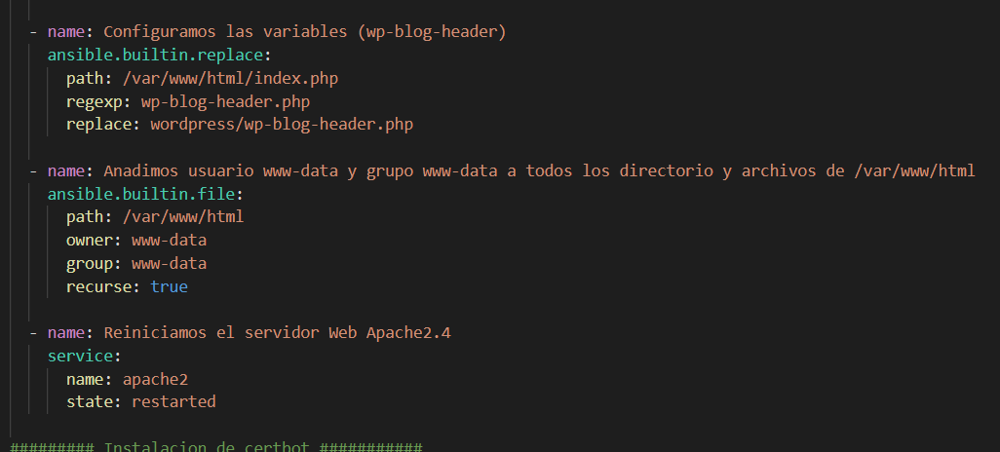

Por ultimo nos queda instalar certbot:

Las variables que he usado son las mismas que antes pero cambiando en este caso el dominio y el host privado por la ip privada de mi maquina backend:

Para comprobar que me funciona le he cambiado el dominio de antes pero los pasos son los mismos:

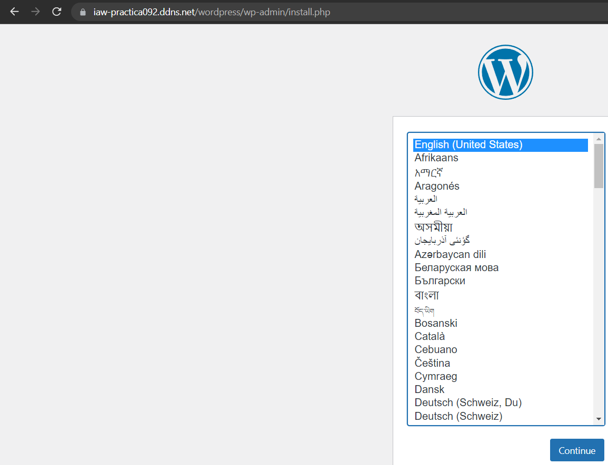

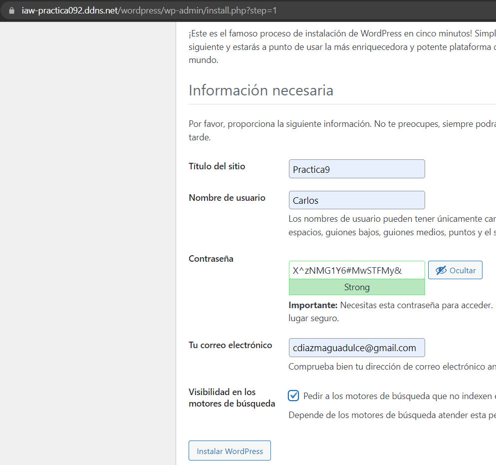

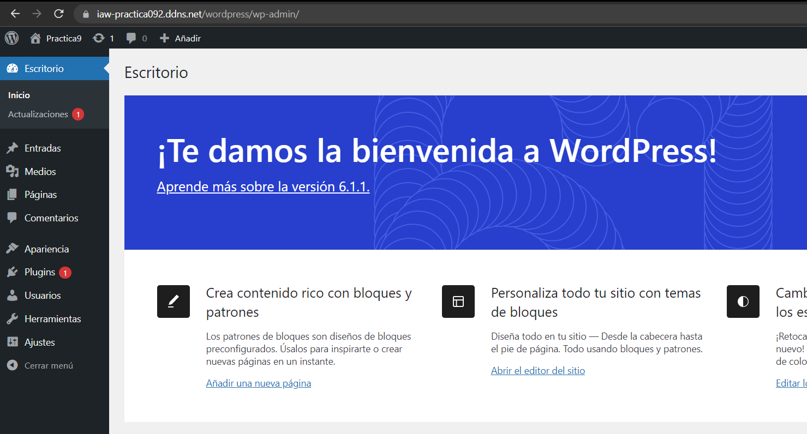

* Fase 02

Ahora vamos a explicar la fase 02. 
Para esta fase vamos a necesitar un total de 5 maquinas. Una backend donde se encuentra la basde de datos MYSQL, dos maquinas frontend donde se encuentras el servidor apache, una maquina parael servidor nfs y por ultimo una maquina balanceadora donde tendra un proxy inverso.

Como ya he explicado el backend y los frontend  en la anterior fase, voy a explicar directamente lo que van a tener mis máquinas nfs y balanceador.

Empezamos por la máquina nfs.
Podemos crearnos dos yml, uno que sera para el cliente nfs que seran nuestras dos maquinas frontend y otra para el servidor nfs que sera nuestra propia maquina nfs.

Lo que tendran nuestros clientes sera la instalación del cleinte nfs y el directorio compartido:

Nuestro servidor nfs tendrá la instalacion del servidor nfs, la creacion del directorio y pasamos el archivo de conf a /etc/exports

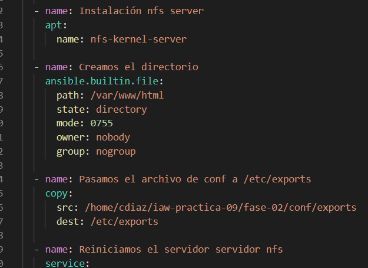

Ahora vamos a irnos a nuestro balanceador donde vamos a instalarnos los modulos del proxy inverso:

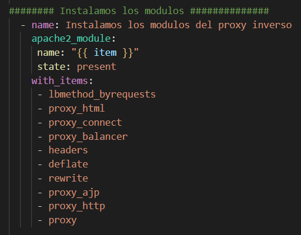

Configuramos los ficheros .conf:

Instalamos certbot:

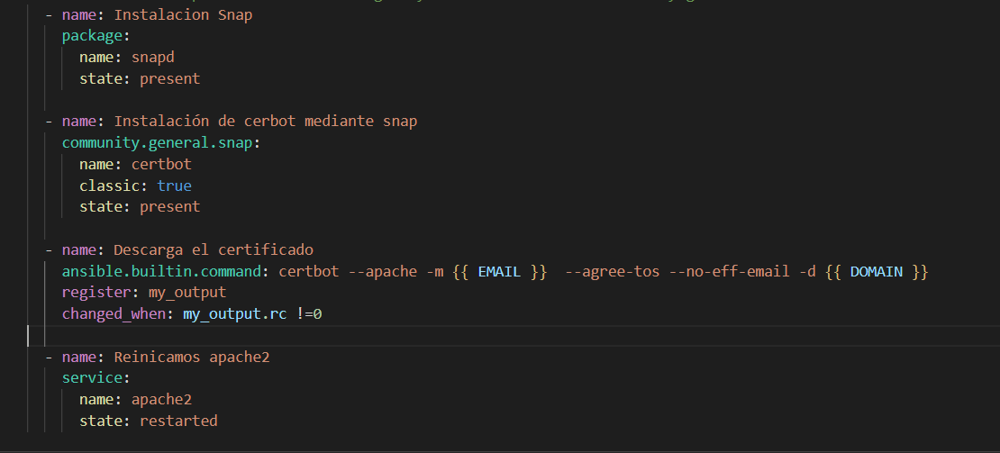

Las variables que he usado son:

**Giphy Gifs will look like:** 
<iframe src="https://giphy.com/embed/ZqlvCTNHpqrio" width="480" height="259" frameBorder="0" class="giphy-embed" allowFullScreen></iframe>
<a href="https://giphy.com/gifs/laughing-despicable-me-minions-ZqlvCTNHpqrio">via GIPHY</a>

**YouTUbe Videos will look like:** 
<iframe width="560" height="315" src="https://www.youtube.com/embed/jTPXwbDtIpA" frameborder="0" allow="accelerometer; autoplay; encrypted-media; gyroscope; picture-in-picture" allowfullscreen></iframe>